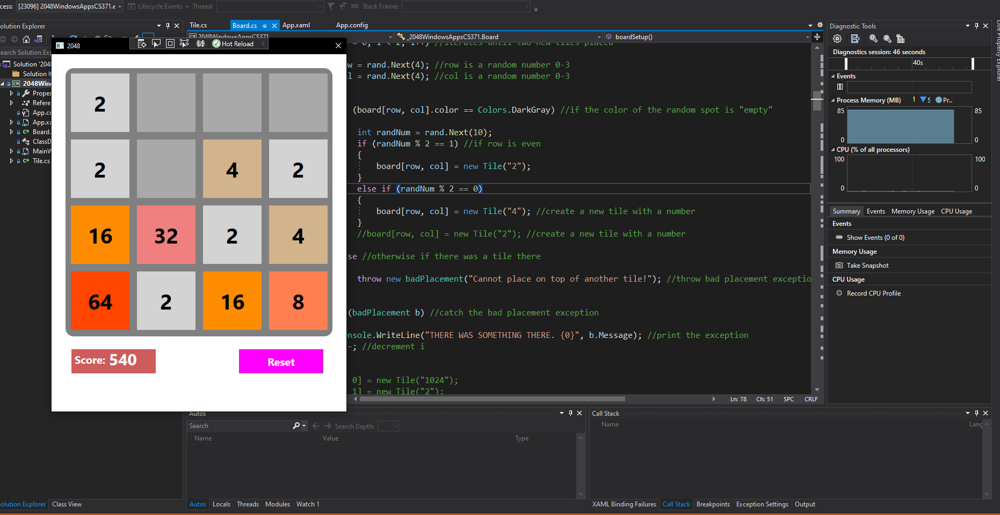
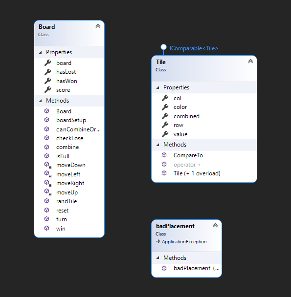
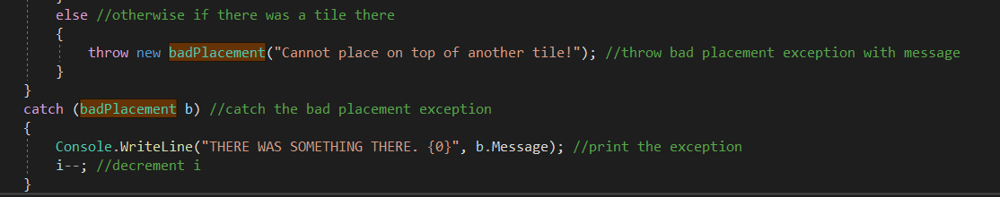

This class talked about how to use the .NET framework with C# and XAML to create a windows application.

For my final project, I worked with one other student to create an application for the game "2048".

2048 is a simple game: you start with a 4x4 grid and two random tiles containing two or four. If you make a move with the arrow keys, a new tile with the value of two or four generates in a random spot on the grid. If you have two of the same values, and move them so that they collide, they add up to give the next highest power of two. The end goal of the game is to combine tiles until you reach 2048, and you lose if the entire board fills up and you cannot make a move.

The game is controlled by three main classes: a board class, a tile class, an exception handling class, and a class that helps our C# code interact with the XAML elements. Below, I have a class diagram to show the member methods and variables of each class, and interfaces that the classes might use.

The exception handling class, badPlacement, helps handle the placement of tiles on our 4x4 grid. This throws an error if a newly generated tile is placed on top of an already existing tile. If the error is thrown, it will be caught and then retry placing the tile.

